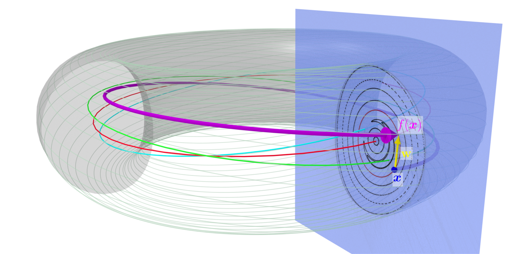

.. |_| unicode:: 0xA0 
   :trim:

.. math:: \newcommand{\pmap}{\mathcal{P}}

Field Line map
==============

In the study of continuous dynamical systems, it is often convenient to consider a discrete map defined by the intersection of the trajectories with a lower-dimensional subspace and which captures some properties of the continuous case. In the case of magnetically confined plasmas, the particles loop around toroidally and the intersection of their trajectories with a constant :math:`\phi` cross-section reveals the distinct region of different field line behaviour |_| : closed surfaces, islands, chaotic regions. This section is known as a `Poincaré` section and to compute it the field lines need to be integrated and record their intersection with the desired cross-section. 

Flow of a vector field
----------------------

Given a magnetic field :math:`\textbf{B}`, or more generally any vector field in 3D, we can define a flow :math:`\Phi(x,t)` as the evolution of a point :math:`x` when following the field from time :math:`t_0` to :math:`t`. It means that the tangent vector for fixed :math:`x` is equal to :math:`\partial_t \Phi(x,t) = \mathbf{B}(\Phi(x,t),t)`. And we can define :math:`\Phi(x,t)` as |_| :

.. math::

   \Phi(x,t) = \int\limits_{t_0}^{t}\mathbf{B}(\Phi(x,s),s)ds.

This is a system of 3 ordinary differential equations (ODEs) that can be solved numerically. To record the intersection with a :math:`\phi=\phi_0` section, the choice of coordinate is relevant. In cartesian coordinates, the current :math:`\phi(x,y)` need to be verified at every step and when it crosses the desired value, one need to interpolate or integrate to look for a more precise intersection. In cylindrical :math:`(r,\phi,z)` and toroidal :math:`(\rho,\phi,\theta)` coordinates, the problem is much simpler as the :math:`\phi` coordinate is already present. In those two cases, we need to consider the :math:`\phi` coordinate as the time variable. Therefore the vector field, that can be written |_| :

.. math::

   \textbf{B}(\Phi(x,t),t) = B^i\partial_i + B^\phi\partial_\phi \quad \text{with} \quad i \in \{r,z\}/\{\rho,\theta\},

need to have a non-vanishing :math:`B^\phi` component. In this case, the map |_| :

.. math::

    t(\phi) = \int\limits_{\phi_0}^{\phi_0+\phi} \frac{dt}{d\phi}ds = \int\limits_{\phi_0}^{\phi_0+\phi} \frac{1}{B^\phi}ds

is a well-define change of variable. Indeed :math:`\Phi(x,t)` can be reparametrized as :math:`\Phi(x,\phi) = \Phi(x,t(\phi))` and |_| :

.. math::

    \partial_\phi{\Phi}^i(\phi) = (\frac{dx^1}{d\phi},\,1,\,\frac{dx^3}{d\phi}) = (\frac{dx^1}{dt}\frac{dt}{d\phi},\,1,\,\frac{dx^3}{dt}\frac{dt}{d\phi}) = (B^1/B^\phi,\, 1,\,B^3/B^\phi).

Due to the choice of coordinates the field will have at most a :math:`\phi` periodicity of :math:`2\pi`, yet in stellarator configurations have azymuthal redundancy. Their period is :math:`T = 2\pi/n_\text{fp}` where :math:`n_\text{fp}\in\mathbb{N}^\star` is the number of field period in a complete toroidal rotation. For example, W7X and LHD have 5 and 10 field periods respectively. If the field is not periodic then :math:`n_\text{fp} = 1`.

.. image:: _static/images/poincare-torus.png
  :width: 400
  :align: center

|
The `Poincaré` section is identical for :math:`\phi_0` and :math:`\phi_i + kT`, :math:`k\in\mathbb{Z}`. Writing :math:`\Omega` the set of initial points in the :math:`\phi_i` plane for which :math:`\Phi` is effectively re-parametrizable between :math:`\phi_i` and :math:`\phi_i + T`, allows to define the map :math:`\pmap : \Omega \rightarrow \mathbb{R}_+\times\mathbb{R}` as |_| :

.. math::

    (x^1, x^2) \mapsto \pmap(x^1, x^2) = \int_{\phi_i}^{\phi_i+T}(
        B^1/B^\phi,\,
        B^3/B^\phi
    )\,ds + (x^1, x^2)
 
The point :math:`(x^1, x^2) \in \Omega` are point in the initial section and should not be confused with the :math:`\Phi(x,\phi)^1` and :math:`\Phi(x,\phi)^3` components which are the evolution of the initial point after angle :math:`\phi`.

Flux conservation
-----------------

As the evolution is performed by following :math:`\mathbf{B}` and due to the magnetic field been divergence free :math:`\nabla\cdot\textbf{B} = 0`, the flux through any surface obtained by mapping a simple path in :math:`\phi_i` to :math:`\phi_i + T` will be zero. This result in the key property of :math:`\pmap` being flux-conserving ; the flux through any closed surface :math:`\Sigma \subset \Omega` is equal to the one through :math:`\pmap(\Sigma)` |_| :

.. math::

    \iint\limits_{\Sigma}\textbf{B}\cdot\textbf{dS} = \iint\limits_{\pmap(\Sigma)}\textbf{B}\cdot\textbf{dS}.

Jacobian of :math:`\mathcal{P}`
-------------------------------

The Jacobian of the field line map as a matrix form :math:`\mathcal{D}\pmap := \partial \pmap^{\{1, 3\}}/{\partial \{1, 3\}} \in \mathbb{R}^{2\times2}`. Here we distinguish between :math:`r, z` in the starting plane and the general evolution around the torus :math:`R = \Phi^R, Z = \Phi^Z`, which is a handy abuse of notation. For instance |_| :

.. math::

    \mathcal{D}\pmap^{r}_{\,\:r} = \frac{\partial}{\partial r}\left[\int_{\phi_i}^{T+\phi_i}\frac{B^R}{B^\phi}d\phi\right] + 1 = \int_{\phi_i}^{\phi_i+T}\partial_{r}\left[\frac{B^R}{B^\phi}\right]d\phi + 1 =\, ...

with $B^R$ and $B^\phi$ being evaluated at |_| :

.. math::

  B^R = B^R(R(r, \phi, z), \phi, Z(r, \phi, z))\\
    B^\phi = B^\phi(R(r, \phi, z), \phi, Z(r, \phi, z)).

The integrand can then be developed using the chain rule |_| :

.. math::

    \partial_{r}\left[\frac{B^R}{B^\phi}\right] &= \partial_{R}\left[\frac{B^R}{B^\phi}\right]\partial_{r}R + \partial_{Z}\left[\frac{B^R}{B^\phi}\right]\partial_{r}Z = \frac{1}{B^\phi}\frac{\partial B^R}{\partial_r} - \frac{B^R}{(B^\phi)^2}\frac{\partial B^\phi}{\partial_r} \\&= \frac{1}{B^\phi}\left(\frac{\partial B^R}{\partial R}\frac{\partial R}{\partial_r}+\frac{\partial B^R}{\partial Z}\frac{\partial Z}{\partial_r}\right) - \frac{B^R}{(B^\phi)^2}\left(\frac{\partial B^\phi}{\partial R}\frac{\partial R}{\partial_r}+\frac{\partial B^\phi}{\partial Z}\frac{\partial Z}{\partial_r}\right).

Without showing the same kind of equality for the other integrands, we can write in matrix form that |_| :

.. math::

    \mathcal{D}\pmap = \int_{\phi_i}^{T+\phi_i}\begin{pmatrix}
        \partial_{R}\left[B^R/B^\phi\right] & \partial_{Z}\left[B^R/B^\phi\right]\\
        \partial_{R}\left[B^Z/B^\phi\right] & \partial_{Z}\left[B^Z/B^\phi\right]
    \end{pmatrix}\cdot\begin{pmatrix}
        \partial_{r}R & \partial_{z}R\\
        \partial_{r}Z & \partial_{z}Z
    \end{pmatrix}d\phi + \mathbb{I}_2

Determinant of the Jacobian
---------------------------

Using differential forms, it can be shown a relation for the determinant of the Jacobian matrix :math:`\mathcal{D}\pmap`. If we write the flux in the form formalism, then :math:`\beta = B^\phi dx^1\wedge dx^3` and the integral becomes |_| :

.. math::

    \iint\limits_{\Sigma}\textbf{B}\cdot\textbf{dS} = \iint\limits_{\pmap(\Sigma)}\textbf{B}\cdot\textbf{dS} \Leftrightarrow \int\limits_{\Sigma}\beta = \int\limits_{\pmap(\Sigma)}\beta = \int\limits_{\Sigma}\pmap^\star\beta

with :math:`\pmap^\star\beta` the pullback of :math:`\beta` through the field line map :math:`\pmap`. Then the flux conservation becomes :math:`\pmap^\star\beta(\pmap(x)) = \beta(x)` and using the relation between the differential forms |_| :

.. math::

    \pmap^\star\beta &= \beta_{i'j'}
    d(\dpmap^{i'}_{\,\:i}x^i)\wedge d(\dpmap^{j'}_{\,\:j}x^j)\\ &= \beta_{i'j'}\left(\dpmap^{i'}_{\,\:i}\dpmap^{j'}_{\,\:j}-\dpmap^{i'}_{\,\:j}\dpmap^{j'}_{\,\:i}\right)dx^i\wedge dx^j = \beta_{ij}\det(\dpmap)dx^i\wedge dx^j

and we see that it implies here |_| :

.. math::

    \det(\dpmap) = \beta_{R\,Z}(x)/\beta_{R\,Z}(\pmap(x)) = B^\phi(x)/B^\phi(\pmap(x))

and we got the same formula back as a direct calculation.This shows the power of differential forms.